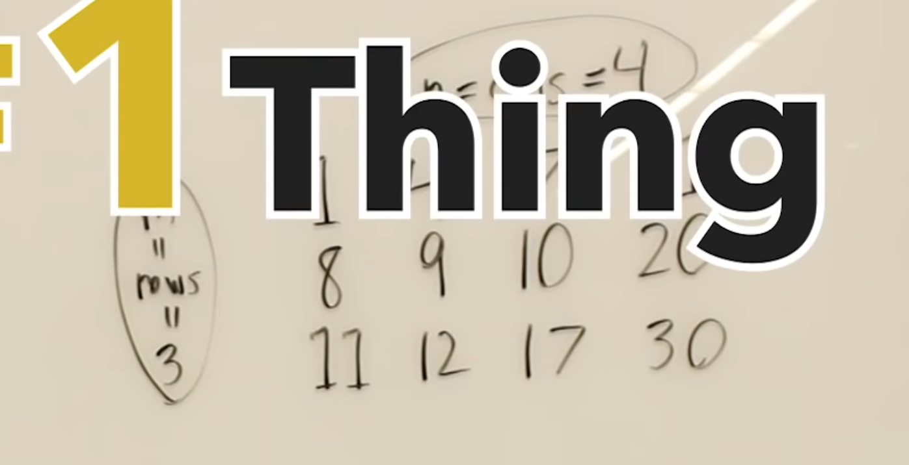

# 2d Matrix Search 

- Need to think of the 2d array as a single array 

## 2d Fully sorted matrix

- Based on the value given by the mid point, the row = val // n , col = val % n 

## Row and Col Sorted Matrix

- up and left reduce value 
- dow and right increase value 
- to find value from the bottom left or top right corner we can make a decision at each point to increase or decrease
in value 
- 