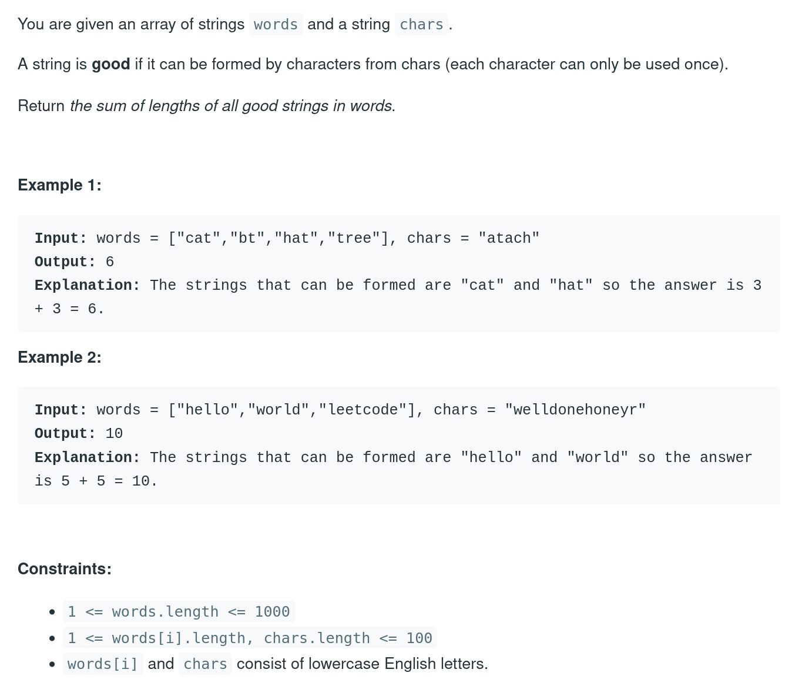

# Binary Search 


- Whenever we get sorted array we should think binary search 

## Problem Ceiling of a Given Number

- arr = [2,3,5,9,14,16,18], target = 15 
- ceiling = smallest element >= target 

```python
def ceiling(arr, target):
    lo, hi = 0, len(arr) - 1
    while lo <= hi:
        mid = (lo + hi) // 2
        if arr[mid] == target:
            return arr[mid]
        if arr[mid] > target:
            hi = mid - 1
        else:
            lo = mid + 1
    return arr[lo]
        
```


