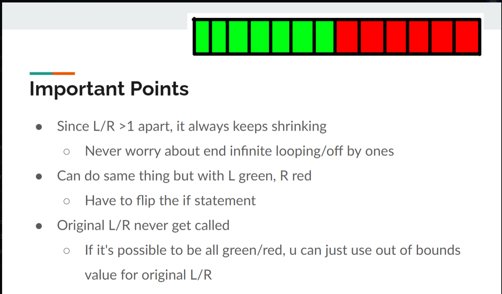

- Binary Search is useful when dealing with SORTED sets, reducing the runtime complexity of a search from O(n) linear
  time to O(log n) time.

- The invariant binary search works by defining two halves (left & right) where left and right exist as pointers where
  Left is where the "Predicate (condition) is TRUE, and Right is where the Predicate Condition is FALSE.

- General Binary Search template

```python
# Direct Relationship

# Lower Bound
# find first occurrence in an array
arr = [1, 2, 3, 4, 4, 4, 5, 6]


def binarySearch(arr, target):
    l, r = -1, len(arr)-1
    while r - l > 1:
        m = (l + r) // 2
        if arr[m] < 0:
            l = m
        else:
            r = m
    if arr[r] == target:  # r is equal to l+1 strictly
        return r
    else:
        return -1


# lower bound, < target, return r (if passes validation)

# Upper Bound
# find last occurrence in an array
arr = [1, 2, 3, 4, 4, 4, 5, 6]


def lastOccur(arr):
    l, r = -1, len(arr)
    while r - l > 1:
        m = (l + r) // 2
        if arr[m] <= 4:
            l = m
        else:
            r = m
    return l


# Inverse Relationship, for f(key): where as key increases, value of f(key) decreases (flip the sign)
# Lower Bound
# find first occurrence in an array
arr = [1, 2, 3, 4, 4, 4, 5, 6]


def firstOccur(arr):
    l, r = -1, len(arr)
    while r - l > 1:
        m = (l + r) // 2
        guess = f(arr[m]);
        if guess > 7:
            l = m
        else:
            r = m
    return r


# Illustration: l & r are split by |*:*|
# Key is in range, Value is result of f(key) a.k.a guess
# [(1,10), (2,9), (3,8), |*:*| (4,7), (4,7), (4,7), (5,6), (6,5)]

# Upper Bound
# find last occurrence in an array
arr = [1, 2, 3, 4, 4, 4, 5, 6]


def lastOccur(arr):
    l, r = 0, len(arr)
    while r - l > 1:
        m = (l + r) // 2
        guess = f(arr[m]);
        if guess >= 7:
            l = m
        else:
            r = m
    return l

# Illustration: l & r are split by |*:*|
# Key is in range, Value is result of f(key) a.k.a guess
# [(1,10), (2,9), (3,8), (4,7), (4,7), (4,7), |*:*| (5,6), (6,5)]
```

```java
#Basic Element Searching
int binarySearch(int[] a, int target) {
    if (a == null || a.length == 0) 
        return -1;

    int l = 0, r = a.length - 1;
    while (l <= r) {
        int mid = (l + r) / 2;
        if (a[mid] == target)
            return mid;
        if (a[mid] > target)
            r = mid - 1; #move left
        else
            l = mid + 1; #move right
    }

    return -1;
}
```

- so 3/5 templates:
-
    1. target binary search
-
    2. lower bound binary search
-
    3. upper bound binary search
- 4?. lower bound binary search (but as f(a[mid]) increases, the result decreases)
- 5?. upper bound binary search (but as f(a[mid]) increases, the result decreases)

- 
- green is your left -> where your predicate is always true. red is your right -> where your predicate is always false.
  Left pointer sits on the innermost green edge Right pointer sits on the innermost red edge

IMPORTANT: One caveat to this template compared to others, is that at the end of your iteration, your left and right
pointers can sit at invalid indexes i.e. L = -1 -> the entire array failed to satisfy the predicate condition, and vice
versa R = arr.length -> the entire array is true for the predicate condition This means two things

1. you have to keep L&R indexes initially slightly out of bounds. I.e. if your valid range is 0 -> arr.length -1, set
   your inital L = 0-1 and R = arr.length - 1 + 1
2. you have to VALIDATE that L&R are in bounds after iterating through binary search, else return -1 Practice Problems (
   implement these using invariant binary search/target binary search):
   https://leetcode.com/problems/find-first-and-last-position-of-element-in-sorted-array/
   https://leetcode.com/problems/cutting-ribbons/
   https://leetcode.com/problems/koko-eating-bananas/
   https://leetcode.com/problems/find-peak-element/


