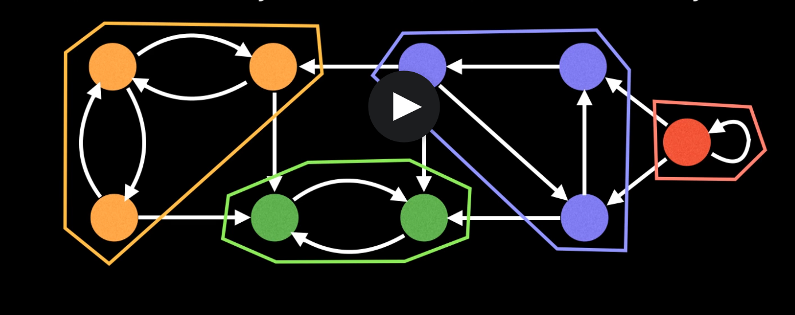

# Common Graph Theory Problems

## Questions to ask yourself 

- graph undirected or directed 
- are the edges weighted? 
- is the graph going to be sparse or dense with edges
- Should I use an adjacency matrix, adjacency list or edge list 

## Shortest Path Problem 

- Algorithms: BFS (unweighted graph), Dijkstra's, Bellman-Ford, Floyd-Warshall, A-start and many more 

### Problems 

- Connectivity 
  - Does there exist a path between Node A and Node B 
  - Typical Solution
    - use union find data structure or any search algo ex: DFS 

- Negative cycles 
  - Does my weighted digraph have any negative cycles? 
  - Algorithms: Bellman-Ford and Floyd-Warshall

- Strongly Connected Components 
  - SCC's can be though of as self contained cycles within a directed graph where every vertex in a given cycle can reach every other 
  vertex in the same cycle 
  - 
  - Algorithms: Tarjan's and Kosaraju's algo 
  - Usually an intermediate step for the problem 

- Traveling Salesman Problem 
  - Given a list of cities and distance between each pair what is the shortest possible route that visits each city exactly once
  and returns to the origin city 
  - NP hard problem 
  - Algorithms: Held-Karp, branch and bound and many heuristics 

- Bridges 
  - A bridge/cut-edge is any edge in a graph whose removal increases the number of connected components 
  - Brdiges hint at weak points, bottlenecks or vulnerabilites in a graph

- Articulation points
  - any node in a graph who's removal increases the number of connected components
  - hint at weak points, bottlenecks or vulnerabilites in a graph

- Minimum Spanning Tree (MST)
  - A MST is a subset of the edges of a connected, edge-weighted graph that connect all the vertices together without any cylces and 
  with the minimum possible total edge weighted
  - Algorithms: Kruskal's, Prim's and Boruvka's 

- Network Flow: Max Flow 
  - Algorithms: Ford-Fulkerson, Edmonds-Karp
