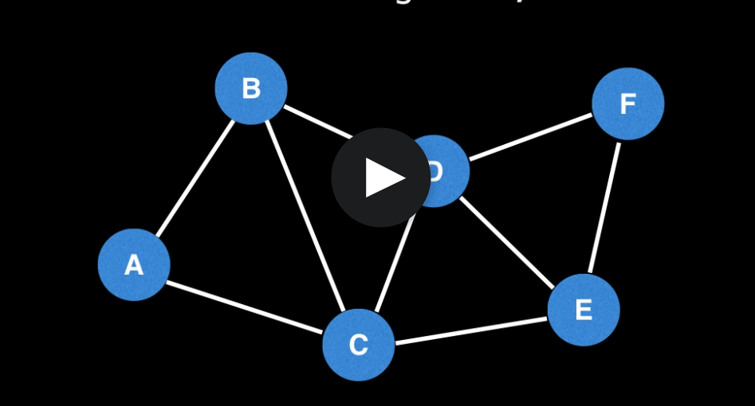
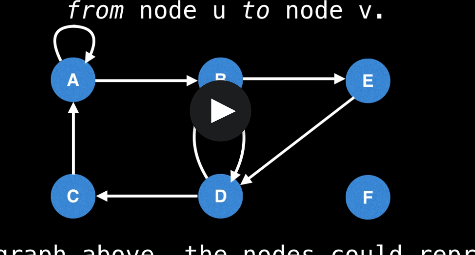
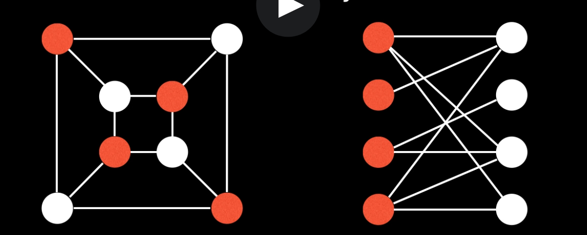

# Intro Notes

## Types of graphs

- Undirected graphs
  - Edges have no orientation. The edge(u,v) is the same as edge (v,u)
  - 
- Directed Graph (Digraph)
  - graph in which edges have orientation
  - The edge (u,v) is the edge from node u to node v
  - 
- Weighted Graphs 
  - Many graphs that contain a certain weight to represent an abritary value 

- Rooted Trees 
  - 

- Directed Aclclic Graphs (DAGS)
 - Directed graph with no cycles 
 - All out trees are DAGs but not all DAGs are out-trees 

- Bipartite Graph 
  - A Bipartite graph is one whose vertices can be split into two independent groups U,V such that every edge connects between U and V 
  - Other definitions: the graph is two colurable or there is no odd length cycles
  - 

- Complete Graphs 
  - complete graph is one where there is a unique edge between every pair of nodes

## Graph Representations 

### Adjacency Matrix 

- the cell m[i][j] represents the edge weight of going from node i to node j
- Pros 
  - space efficient for dense graphs 
  - edge weight lookup is O(1)
- Cons 
  - Requires O(V^2) space
  - Iterating over all edges takes O(V^2) time 

### Adjacency List 

- graph as a map with a list of nodes to list of edges 
- Pros 
  - space efficient for sparse graphs 
  - iterating over all edges is efficient
- Cons 
  - less space efficient for dense graphs
  - Edge weight lookup is O(E)

### Edge List

- Represent graph as a list of unordered edges 

